Fast R-CNN Object Detection Tutorial for Microsoft Cognitive Toolkit (CNTK)
==============

DESCRIPTION
--------------

Object Detection is one of the main problems in Computer Vision. Traditionally, this required expert knowledge to identify and implement so called “features” that highlight the position of objects in the image. Starting in 2012 with the famous AlexNet paper, Deep Neural Networks are used to automatically find these features. This lead to a huge improvement in the field for a large range of problems.

This tutorial uses Microsoft Cognitive Toolkit's (CNTK) fast R-CNN implementation (see the [Fast R-CNN](#fast-r-cnn) section for a description) which was shown to produce state-of-the-art results for [Pascal VOC](http://host.robots.ox.ac.uk/pascal/VOC/), one of the main object detection challenges in the field.

GOALS
--------------

The goal of this tutorial is to show how to train and test your own Deep Learning object detection model using [Microsoft Cognitive Toolkit (CNTK)](https://github.com/Microsoft/CNTK). Example data and annotations are provided, but the reader can also bring their own images and train their own, unique, object detector.

The tutorial is split into four parts:
-	[Part 1](#part-1) shows how to train an object detection model for the example data without retraining the provided Neural Network, but instead training an external classifier on its output. This approach works particularly well with small datasets, and does not require expertise with deep learning.
-	[Part 2](#part-2) extends this approach to refine the Neural Network directly. The advantages / disadvantages of this approach will be discussed in
-	[Part 3](#part-3) illustrates how to annotate your own images and use these to train an object detection model for your specific use case.
-	[Part 4](#part-4) covers how to reproduce published results on the Pascal VOC dataset.

Previous expertise with Machine Learning while not required to complete this tutorial, however is very helpful to understand the underlying principles. More information on the topic can also be found at [CNTK's Fast-RCNN page](https://github.com/Microsoft/CNTK/tree/master/Examples/Image/Detection/FastRCNN).


PREREQUISITS
--------------

This tutorial requires CNTK version >= 2.0 and Python version 2 to be installed. Both 32-bit and 64-bit versions of Python are supported, however 32-bit Python runs out of memory during SVM training even if the dataset is small (such as the provided example dataset for grocery detection). The python interpreter can be downloaded from the [official download page](https://www.python.org/downloads/windows/), and CNTK installation instructions are given on the [download page](https://github.com/Microsoft/CNTK/wiki/CNTK-Binary-Download-and-Configuration). CNTK will also install a Python Anaconda environment which we will not use (since this tutorial was written for Python 2). In the following we assume that the python interpreter is installed in *C:/Python/* and the CNTK binaries are in *C:/local/cntk/cntk/*. A dedicated GPU is not required, but recommended for retraining of the Neural Network (part 2).

Several Python packages are required to execute the python scripts: Pillow, xmltodict, wheel, numpy, opencv, scikit-learn, scipy, matplotlib, scikit-image, easydict and selectivesearch. These libraries can be installed easily using the provided python wheels  in *resources/python2_{32,64}bit_requirements/*. The libraries can be installed by opening a command prompt and running:
````bash
cd resources/python2_64bit_requirements/
C:/Python/Scripts/pip.exe install -r requirements.txt
````
This assumes the python interpreter is installed to the directory *C:/Python/*. The resource files and the original zip file can be deleted once installation completed. The python wheels were originally downloaded from this [page](http://www.lfd.uci.edu/~gohlke/pythonlibs/).

Typically *pip.exe* comes installed with Python. If that is not the case on your system, or if the *C:/Python/Scripts/* directory does not exist, then this command should install it:
````bash
C:/Python/python -m ensurepip
````

If the CNTK binaries are not located at "C:/local/cntk/cntk/", the variable `cntkBinariesDir` in `PARAMETERS.py` needs to be updated to point to the correct directory:
```python
cntkBinariesDir = "myCntkBinariesDirectory>"
```

And finally, the file *AlexNet.89* is too big to be hosted in Github and hence needs to be downloaded manually from [here](https://objectdetectionusingcntk.blob.core.windows.net/objectdetectionusingcntk/AlexNet.89) and placed into the subfolder */resources/cntk/AlexNet.89*.

If you lack a strong GPU, don't want to install CNTK yourself, or want to train a model using multiple GPUs, then consider using Azure's Data Science Virtual Machine. The GPU-VMs are currently in preview model but will be fully available soon. See the [Cortana Intelligence Gallery](https://gallery.cortanaintelligence.com/Solution/Linux-Data-Science-Virtual-Machine-3) for a 1-click deployment solution.


FOLDER STRUCTURE
--------------

|Folder| Description
|---|---
|/|				Root directory
|/data/|			Directory containing images for different object recognition projects
|/data/grocery/|			Example data for grocery item detection in refrigerators
|/data/grocery/positives/|	Images and annotations to train the model
|/data/grocery/negatives/|	Images used as negatives during model training
|/data/grocery/testImages/|	Test images used to evaluate model accuracy
|/fastRCNN/|			Slightly modified code used in R-CNN publications
|/resources/|		  All provided resources are in here
|/resources/cntk/|   CNTK configuration file and pre-trained AlexNet model
|/resources/python2_32_bit_requirements/|   Python wheels and requirements file for 32bit Python
|/resources/python2_64_bit_requirements/|   Python wheels and requirements file for 64bit Python

All scripts used in this tutorial are located in the root folder.
<!-- The provided grocery example images are in the public domain and were downloaded from [www.publicdomainpictures.net](http://www.publicdomainpictures.net/). -->

PART 1
--------------
In the first part of this tutorial we will train a classifier which uses, but does not modify, a pre-trained deep neural network. See the [Fast R-CNN](#fast-r-cnn) section for details of the employed approaches. As example data 30 images of grocery items inside refrigerators are provided, split into 25 images for training and the remaining 5 images are used as test set. The training images contain in total 153 annotated objects, these are (with individual counts in brackets):
```
Avocado (13),  orange (8), butter (13), champagne (12), eggBox (13),
gerkin (11), joghurt (11), ketchup (14), milk (13), mustard (5),
orangeJuice (17), onion (10), pepper (27), tabasco (6), tomato (19),
and water (7).
```
Note that 10 to 20 examples per class is a very low number and too little train a high-accuracy detector. Nevertheless, even this small dataset is sufficient to return plausible detections as can be seen in step 5.  
Every step has to be executed in order, and we recommend after each step to inspect which files are written, where they are written to, and what the content of these files is (mostly the content is written as text file).


### STEP 1: Computing Region of Interests
`Script: 1_computeRois.py`

Region-of-interests (ROIs) are computed for each image independently using a 3-step approach: First, Selective Search is used to generate hundreds of ROIs per Image. These ROIs often fit tightly around some objects but miss other objects in the image (see [Selective Search](#selective-search) section). Many of the ROIs are bigger, smaller, etc. than the typical grocery item in our dataset. Hence in a second step these ROIs are discarded. Finally, to complement the detected ROIs from Selective Search, ROIs that uniform cover the image are added at different scales and aspect ratios.

The final ROIs are written for each image separately to the files *[imageName].roi.txt* in the *proc/grocery/rois/* folder.

For the grocery dataset, the approach outlined above generates between 1500 and 2000 ROIs per image. The goodness of these ROIs can be measured by counting how many of the ground truth annotated objects in the image are covered by at least one ROI, where "covered" is defined as having an overlap greater than a given threshold. Script `B1_evaluateRois.py` outputs these counts at different threshold values.

ROIs computed using Selective Search (left); ROIs from the image above after discarding ROIs that are too small, too big, etc. (middle); Final set of ROIs after adding ROIs that uniformly cover the image (right).
<p align="center">
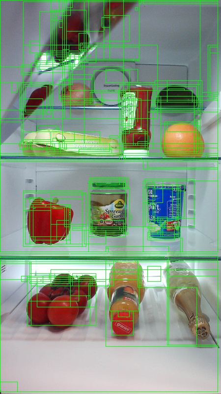
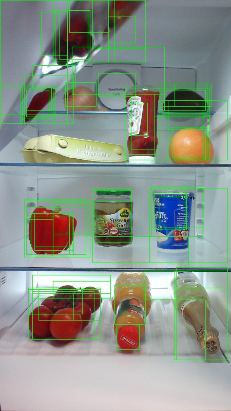
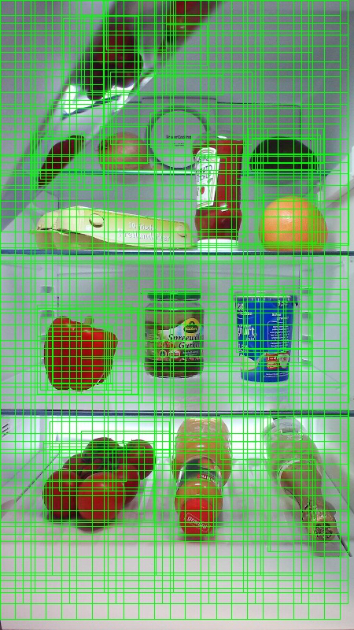
</p>


### STEP 2: Computing CNTK inputs
`Script: 2_cntkGenerateInputs.py`

Each ROI generated in the last step has to run through the CNTK model to compute its 4,096 float Deep Neural Network representation (see the [Fast R-CNN](#fast-r-cnn) section). This requires three CNTK-specific input files to be generated for the training and the test set:
- *{train,test}.txt*: each row contains the path to an image.
-	*{train,test}.rois.txt*: each row contains all ROIs for an image in relative (x,y,w,h) co-ordinates.
-	*{train,test}.roilabels.txt*: each row contains the labels for the ROIs in one-hot-encoding.

An in-depth understanding of how these files are structured is not necessary to understand this tutorial. However, two points are worth pointing out:
-	CNTK’s fast R-CNN implementation requires all images to be of the same size. For this reason, all images are first scaled and then centered and zero-padded (i.e. columns of gray-colored pixels are added to the left and right of the image, or respectively rows at the top and bottom). Note that the scaling preserves the original aspect ratio. For our experiments we use input width and height of 1000 x 1000 pixels to the Neural Network.  
Interestingly, upscaling an image can significantly improve accuracy if the objects to be detected are small (this is due to objects in ImageNet typically having a width and height of 100-200 pixels).
-	CNTK expects each image to have the same number of ROIs (for our experiments we use 2000). Hence, if the computation in step 1 returned more ROIs, then only the first 2000 are used. Likewise, if less ROIs were found, then the remaining spots are filled using ROIs with co-ordinates of (0,0,0,0). These “zero-padded” ROIs are only used during CNTK execution and have no influence on the training / test performance.

This step writes the above mentioned files to the directory *proc/grocery/cntkFiles/*. For debugging, the script `B2_cntkVisualizeInputs.py` can be used to visualize the content of these files (e.g. the Figure at the end of step 4 was generated using this script).


### STEP 3: Running CNTK
`Script: 3_runCntk.py`

We can now run the CNTK executable which takes as input the co-ordinates and labels files from the last step and outputs the 4096 float embedding for each ROI and for each image. This will take some minutes to process, and will automatically run on GPU if detected.

This generates two potentially very big files: *test.z* and *train.z* in the *proc/grocery/cntkFiles/* directory. Given e.g. our 25 training images and 2000 ROIs per image, the train.z file will contain 25 \* 2000 \* 4096 = 204.8 million floating point values in ASCII format. After the CNTK executable finished running, these two files are then parsed and separate (compressed) files written for each image to *proc/grocery/cntkFiles/{train,test}_svm_parsed/[imageName].dat.npz*. While not technically necessary, this makes reading of the CNTK output easier in subsequent steps. Once parsed, the *test.z* and *train.z* files are not needed anymore and are automatically deleted.

### STEP 4: Classifier training
`Script: 4_trainSvm.py`

We now train the classifier which given an ROI as input, assigns it to one of the grocery items or to a “background” class.

We use a slightly modified version of the published R-CNN code to train a linear SVM classifier. The main change is to load the 4096 floats ROI embedding from disk rather than to run the network on-the-fly. An in-depth explanation of the training procedure can be found in the [R-CNN paper](http://arxiv.org/abs/1311.2524). For the purpose of this tutorial we consider the training script a black box, which uses the training ROIs as input (or to be precise the 4096 floats representations), and outputs N+1 linear classifiers, one for each class, plus one for the background.

The training starts by loading all positive ROIs into memory. Positive here corresponds to each ROI that has a significant overlap with a ground truth annotated object. Negatives are then iteratively added using hard negative mining, and the SVM is retrained. A list and short description of the parameters that govern the SVM training can be found in the script `PARAMETERS.py`.

The learned linear classifiers for each class, i.e. a weight vector of dimension 4096 floats plus a float that represents the bias term, are then written to the folder *proc/grocery/trainedSVMs/*.

Annotated data used for training: (left) Ground truth annotation; (right) Automatically adding ROIs which significantly overlap with ground truth:  
<p align="center">
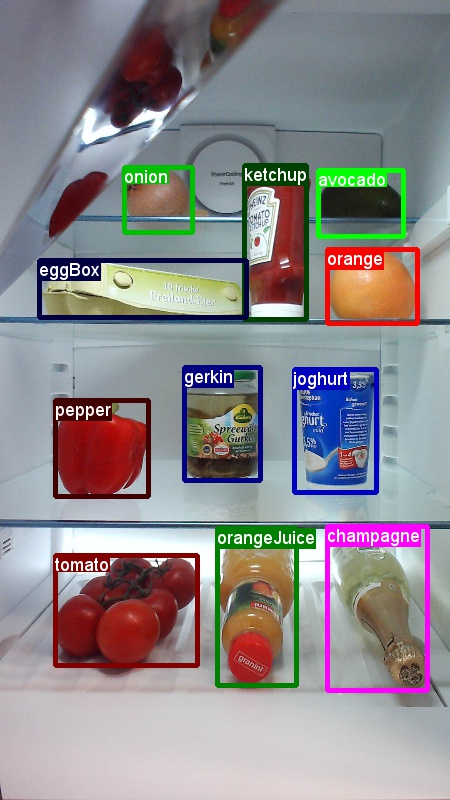
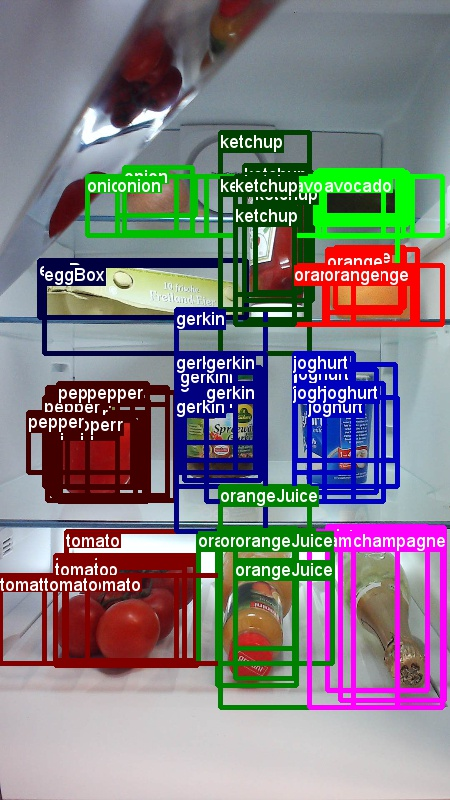
</p>

### STEP 5: Evaluation and visualization
`Scripts: 5_evaluateResults.py and 5_visualizeResults.py`

Once training succeeded, the model can be used to find objects in images. For this, every ROI in an image is classified and assigned a confidence to be avocado, orange, butter, ... and background. The class with highest confidence is then selected (most often “background”) and optionally a threshold applied to reject detections with low confidence.

The accuracy of the classifier can be measured using the script `5_evaluateResults.py`. This outputs the mean Average Precision (mAP; see the [Mean Average Precision](#mean-average-precision) section) for either the training or the test set.
Note that mAP's for both set are similar, which indicates that the classifier does not over-fit to the training data. However, keep in mind that the test set only contains 5 images and hence these numbers need to be taken with a grain of salt. Due to randomization effects one should get similar, although likely not identical numbers when running the script.

<!-- Note that the mAP for the training set is much higher than for the test set. This is because the classifier was able to memorize the (tiny) training set but not to generalize well to new images (aka. over-fitting). Also, the accuracy on cars is much better than for people, which might be due to the fact that cars are typically much bigger in the image. The accuracy on the test is very bad, which is due to the detections being not very accuracy (see the results for the three images below) and due to test set containing only three images. -->

|Dataset|     AP(avocado)|AP(orange)|AP(butter)|AP(champagne)|   | mAP
|---|---|---|---|---|---|---
|Training set|0.49       |0.63      |0.69      |1.0          |...|**0.80**
|Test Set|    1.00       |0.25      |0.56      |1.0          |   |**0.82**

<!-- AP for         avocado = 1.0000
AP for          orange = 0.2500
AP for          butter = 0.5556
AP for       champagne = 1.0000
AP for          eggBox = 1.0000
AP for          gerkin = 1.0000
AP for         joghurt = 0.5556
AP for         ketchup = 1.0000
AP for     orangeJuice = 0.7500
AP for           onion = 1.0000
AP for          pepper = 1.0000
AP for          tomato = 0.8000
AP for           water = 1.0000
AP for            milk = 1.0000
AP for         tabasco = 0.2500
AP for         mustard = 1.0000
Mean AP = 0.8226 -->

<!-- AP for         avocado = 0.4858
AP for          orange = 0.6250
AP for          butter = 0.6879
AP for       champagne = 1.0000
AP for          eggBox = 0.7821
AP for          gerkin = 0.8595
AP for         joghurt = 0.8512
AP for         ketchup = 0.8302
AP for     orangeJuice = 0.8676
AP for           onion = 0.5550
AP for          pepper = 1.0000
AP for          tomato = 1.0000
AP for           water = 1.0000
AP for            milk = 1.0000
AP for         tabasco = 0.5000
AP for         mustard = 0.8000
Mean AP = 0.8028 -->

The output of the classifier can be visualized using the script `5_visualizeResults.py`. Only ROIs classified as grocery item are shown (not background), and only if the confidence in the detection is greater or above 0.5. Multiple ROIs are combined into single detections using   [Non-Maxima Suppression](#non-maxima-suppression), the output of which is visualized below for the test images:  
<p align="center">
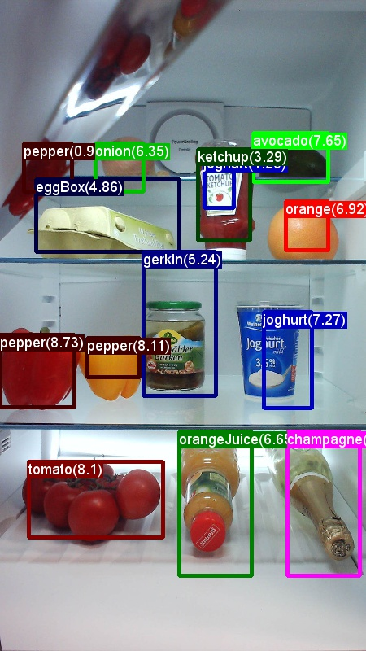
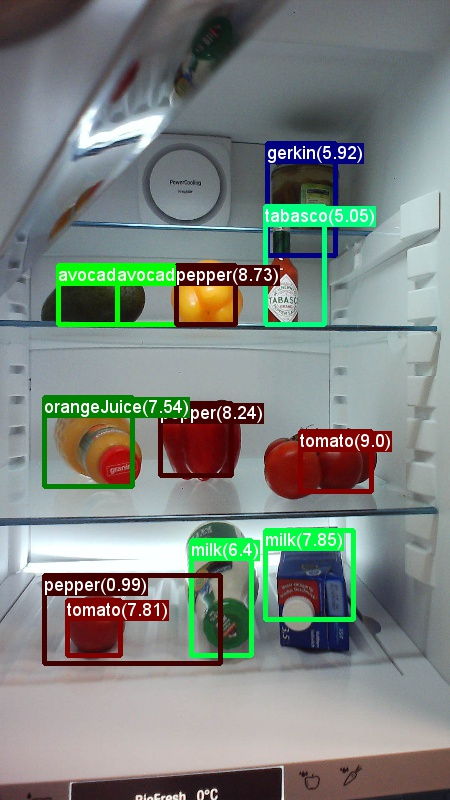
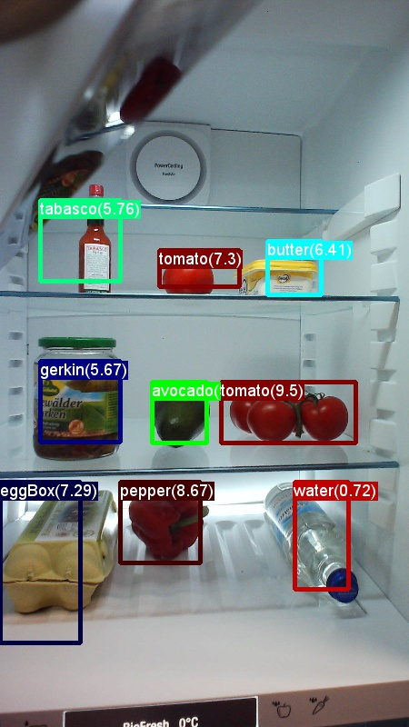
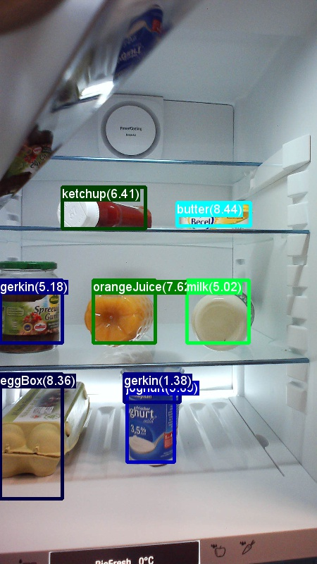
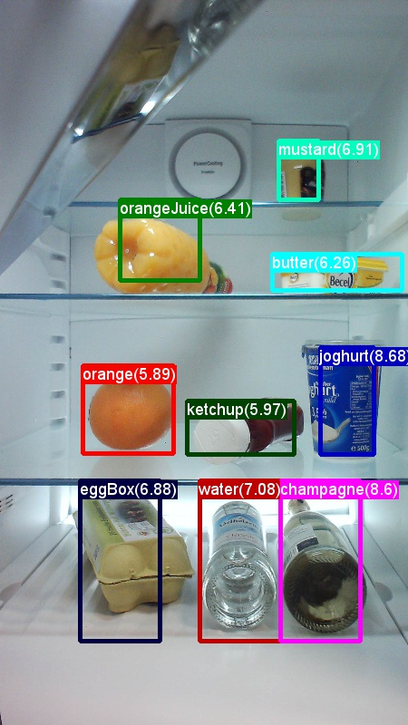
</p>


PART 2
--------------
In part 1 we learned how to classify ROIs by training a linear Support Vector Machine on the output of a given Neural Network. We will now show how to instead perform this classification directly in the Deep Neural Network. This can be achieved by adding a new last layer which, given the input from the last fully connected layer, outputs the probabilities for each ROI to be of a certain class. See section [SVM vs NN training](#svm-vs-nn-training) for pros/cons of the two different approaches.

Training the Neural Network instead of an SVM is done by simply changing the variable `classifier` in `PARAMETERS.py` from "svm" to "nn". Then, as described in part 1, all the scripts need to be executed in order, except for the SVM training in step 4. This will add a classification layer to the network and train the last layer(s) of the network, and for each ROI write its classification label and confidence to disk (rather than the 4096 floats representation which was required to train the SVM). Note that NN training can cause an out-of-memory error on less powerful machines which can possibly be avoided by reducing the number of ROIs per image from 2000 to e.g. 200 (see variable `cntk_nrRois` in `PARAMETERS.py`).

The mean Average Precision measure after running all steps should roughly look like the results below. Note that the accuracy on the training set is much higher compared to training a linear SVM (part 1, step 5). This is because the neural network is less regularized and hence able to memorize the training set better.

|Dataset|     AP(avocado)|AP(orange)|AP(butter)|AP(champagne)|   | mAP
|---|---|---|---|---|---|---
|Training set|1.00       |0.83      |0.91      |1.00         |...|**0.96**
|Test Set|    1.00       |1.00      |0.67      |0.75         |   |**0.87**

<!-- AP for         avocado = 1.0000
AP for          orange = 1.0000
AP for          butter = 0.6667
AP for       champagne = 1.0000
AP for          eggBox = 0.7500
AP for          gerkin = 1.0000
AP for         joghurt = 0.6667
AP for         ketchup = 1.0000
AP for     orangeJuice = 1.0000
AP for           onion = 1.0000
AP for          pepper = 1.0000
AP for          tomato = 0.8000
AP for           water = 0.5000
AP for            milk = 1.0000
AP for         tabasco = 0.5000
AP for         mustard = 1.0000
Mean AP = 0.8677 -->

<!-- AP for         avocado = 1.0000
AP for          orange = 0.8281
AP for          butter = 0.9112
AP for       champagne = 1.0000
AP for          eggBox = 0.9231
AP for          gerkin = 1.0000
AP for         joghurt = 1.0000
AP for         ketchup = 1.0000
AP for     orangeJuice = 0.9412
AP for           onion = 0.8900
AP for          pepper = 1.0000
AP for          tomato = 0.9418
AP for           water = 1.0000
AP for            milk = 1.0000
AP for         tabasco = 0.9762
AP for         mustard = 1.0000
Mean AP = 0.9632 -->

The output of the Neural Network on the five test images after Non-Maxima Suppression to combine multiple detections should look like this:  
<p align="center">
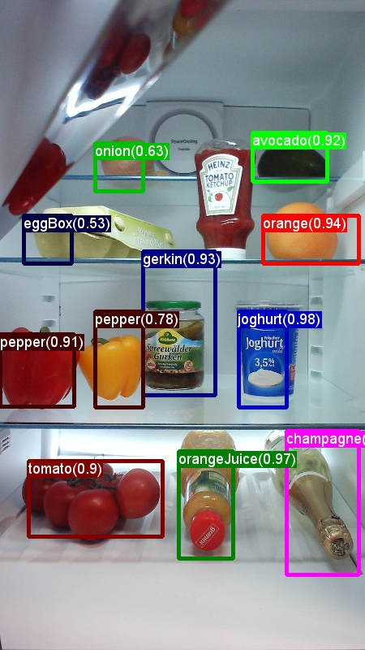
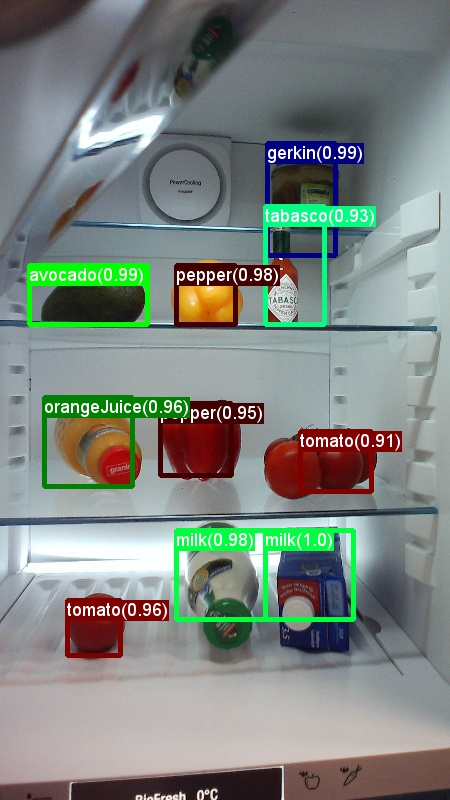
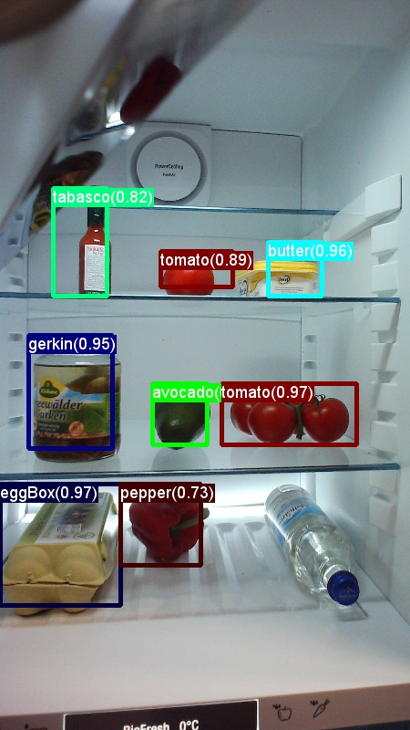
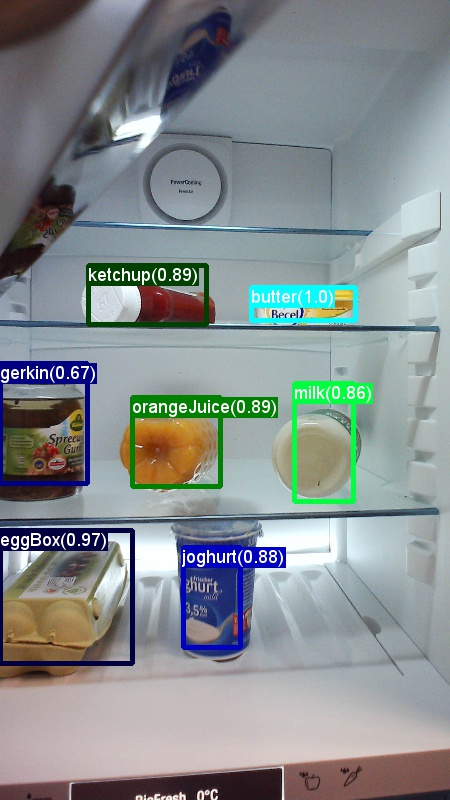
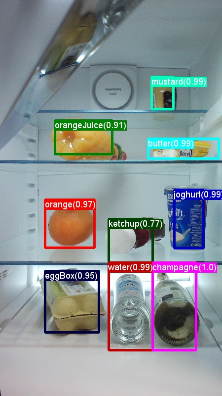
</p>

PART 3
--------------
So far we trained and evaluated object detectors using the provided grocery dataset. It is very straight forward to use a custom dataset instead: the necessary scripts for image annotation are included in the repository, and only minor code changes are required to point to a new dataset.

First, lets have a look at the folder structure and the provided annotation files for the grocery data:  
Note how all positive, negative and test images and their annotations are in the subfolders *positive*, *negative* and *testImages* of *data/grocery/*. Each image (with the exception of the negative images) has (i) a similarly named *[imageName].bboxes.txt* file where each row corresponds to the co-ordinates of a manually labeled object (aka. bounding box); and (ii) a *[imageName].bboxes.labels.txt* file where each row corresponds to the class of the object (e.g. avocado or orange).


### Image Annotation

These two *.txt* files per image can be generated using the scripts `A1_annotateImages.py` and `A2_annotateBboxLabels.py`.

The first script lets the user draw rectangles around each object (see left image below). Once all objects in an image are annotated, pressing key 'n' writes the *.bboxes.txt* file and then proceeds to the next image, 'u' undoes (i.e. removes) the last rectangle, and 'q' quits the annotation tool.

The second script loads these manually annotated rectangles for each image, displays them one-by-one, and asks the user to provide the object class by clicking on the respective button to the left of the window (see right image below). Ground truth annotations marked as either "undecided" or "exclude" are fully excluded from further processing.   
<p align="center">
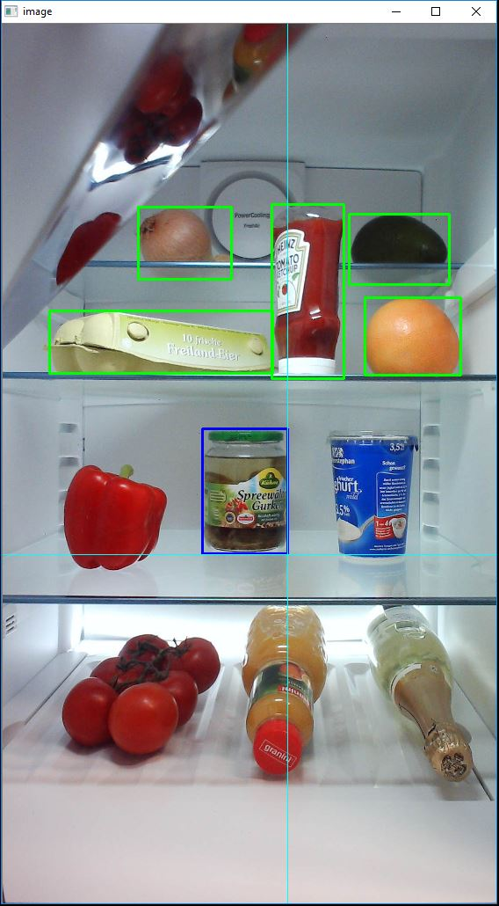
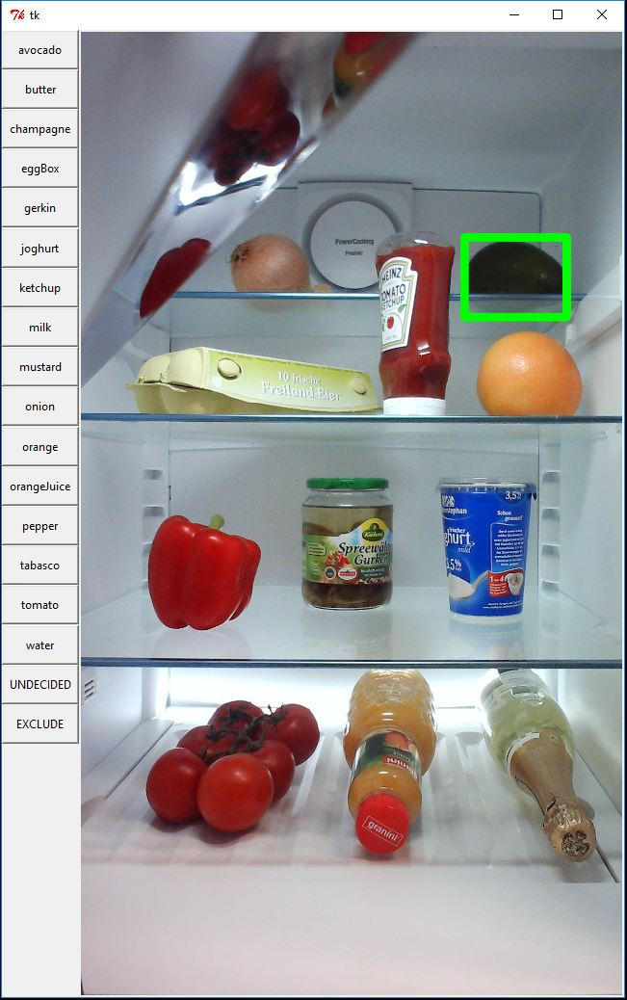
</p>

### Using a custom dataset

Once all (non-negative) images are annotated, the images and *.txt* annotation files should be copied to the *positive*, *negative* and *testImages* subfolders of a new directory called *data/myOwnImages/*, where the string "myOwnImages" can be replaced at will.

The only required code change is to update the `datasetName` variable in `PARAMETERS.py` to the newly created folder:
```python
datasetName = "myOwnImages"
```

All steps in part 1 can then be executed in order and will use the new dataset.


### How to get good results

As is true for most Machine Learning project, getting good results requires careful parameter tuning. To help with this, all important parameters are specified, and a short explanation provided, in a single place: the `PARAMETERS.py` file.

Here now a few tips on how to find good parameters / design a good training set:
- Select images carefully and perform annotations identically across all images. Typically, all objects in the image need to be annotated, even if the image contains many of them. It is common practice to remove such cluttered images. This is similarly true also for images where one is uncertain about the label of an object or where it is unclear whether the object should even be annotated (e.g. due to truncation, occlusion, motion blur, etc.).
- During Region-of-Interest generation in step 1, all ROIs which are deemed too small, too big, etc. are discarded. This filtering step relies on thresholds on the respective properties and are defined in `PARAMETERS.py` (paragraph "ROI generation").  
Visualizing the generated ROIs helps tremendously for debugging and can be done either while computing the ROIs in the script `1_computeRois.py` itself, or by visualizing the CNTK training files using the script `B2_cntkVisualizeInputs.py`. In addition, script `B1_evaluateRois.py` computes the percentage of annotated ground truth objects that are covered by one or more ROI (i.e. recall).
- Training a linear SVM (step 4) is relatively robust and hence for most problems the corresponding parameters in `PARAMETERS.py` (paragraph "svm training") do not need to be modified.
The evaluation script `5_evaluateResults.py` can be used to verify that the SVM successfully learned to capture the training data (typically the APs are above 0.5).
- Training a Neural Network (part 2) is significantly more difficult, and often requires expert knowledge to make the network converge to a good solution (see [Michael Nielsen's](http://neuralnetworksanddeeplearning.com/) great introduction to Deep Neural Networks). The arguably most important parameter here is the learning rate.
- In addition to computing mAP, always also visualize the results on the test and on the training set. This is done with script `5_visualizeResults.py` and helps getting an understanding of the error modes, and to verify the model is behaving as expected.

### Publishing the model as Rest API

Finally, the trained model can be used to create a web service or Rest API on Azure. For this we recommend using a technology called Flask, which makes it easy to run Python code in the cloud. See the tutorial [Creating web apps with Flask in Azure](https://azure.microsoft.com/en-us/documentation/articles/web-sites-python-create-deploy-flask-app/) for step-by-step instructions.


PART 4
--------------
The last part of this tutorial shows how to reproduce published results on the Pascal VOC dataset.

First, the Pascal VOC data as well as the pre-computed Selective Search boxes need to be downloaded from these links: [VOCtest_06-Nov-2007.tar](http://host.robots.ox.ac.uk/pascal/VOC/voc2007/VOCtest_06-Nov-2007.tar),
[VOCtrainval_06-Nov-2007.tar](http://host.robots.ox.ac.uk/pascal/VOC/voc2007/VOCtrainval_06-Nov-2007.tar),
[selective_search_data.tgz](http://www.cs.berkeley.edu/~rbg/fast-rcnn-data/selective_search_data.tgz).

<VOC 2012 trainval http://host.robots.ox.ac.uk/pascal/VOC/voc2012/VOCtrainval_11-May-2012.tar>

<DELETE How to download the Pascal VOC 2007 and 2012 datasets is described on the [Fast R-CNN](https://github.com/rbgirshick/fast-rcnn) page, section "Beyond the demo: installation for training and testing models". The page also describes how to download the pre-computed Selective Search boxes (using script `fetch_selective_search_data.sh`).>


These three tar-compressed files should to be extracted and copied into the *resources/pascalVocData/* directory. Your resources folder should look like this:
```bash
resources/pascalVocData/selective_search_data
resources/pascalVocData/VOCdevkit2007/VOC2007
resources/pascalVocData/VOCdevkit2007/VOC2007/Annotations
resources/pascalVocData/VOCdevkit2007/VOC2007/ImageSets
resources/pascalVocData/VOCdevkit2007/VOC2007/JPEGImages
```

Second, the `datasetName` variable in `PARAMETERS.py` needs to point to the Pascal VOC dataset instead of our grocery dataset:
```python
datasetName = "pascalVoc"
```

Now the steps from part 1 can be executed in order with the exception of:
- Step 1: ROI generation is not necessary since we use the downloaded Selective Search boxes instead.
- Step 4: SVM training is not necessary since the classification is done by adding a new softmax layer to the network (similar to part 2).

Note that Pascal VOC is a very big dataset and hence some of the steps (especially the CNTK training in step 3) will take hours to complete.

The table below shows the mean Average Precision (mAP) of our final model, and compares this figure to the corresponding experiment in the [Fast R-CNN](https://arxiv.org/pdf/1504.08083v2.pdf) paper (Table 6, group "S"). Note that this tutorial uses an AlexNet architecture, and we do not perform bounding box regression. To be consistent with the paper, our model is trained using the VOC 2007 "trainval" set, and the mean Average Precision is computed on the VOC 2007 "test" set.

|Dataset| mAP
|---|---
|Published results|0.52
|Our results|0.48

More information on training a PascalVOC classifier (including a download link to a trained model) can be found at [CNTK's Fast-RCNN page](https://github.com/Microsoft/CNTK/tree/master/Examples/Image/Detection/FastRCNN).


TECHNOLOGY
--------------

### Fast R-CNN
R-CNNs for Object Detection were first presented in 2014 by [Ross Girshick et al.](http://arxiv.org/abs/1311.2524), and shown to outperform previous state-of-the-art approaches on one of the major object recognition challenges in the field: [Pascal VOC](http://host.robots.ox.ac.uk/pascal/VOC/). Since then, two follow-up papers were published which contain significant speed improvements: [Fast R-CNN](https://arxiv.org/pdf/1504.08083v2.pdf) and [Faster R-CNN](https://arxiv.org/abs/1506.01497).

The basic idea of R-CNN is to take a deep Neural Network which was originally trained for image classification using millions of annotated images and modify it for the purpose of object detection. The basic idea from the first R-CNN paper is illustrated in the Figure below (taken from the paper): (1) Given an input image, (2) in a first step, a large number region proposals are generated. (3) These region proposals, or Regions-of-Interests (ROIs), are then each independently sent through the network which outputs a vector of e.g. 4096 floating point values for each ROI. Finally, (4) a classifier is learned which takes the 4096 float ROI representation as input and outputs a label and confidence to each ROI.  
<p align="center">

</p>

While this approach works well in terms of accuracy, it is very costly to compute since the Neural Network has to be evaluated for each ROI. Fast R-CNN addresses this drawback by only evaluating most of the network (to be specific: the convolution layers) a single time per image. According to the authors, this leads to a 213 times speed-up during testing and a 9x speed-up during training without loss of accuracy.

The original Caffe implementation used in the R-CNN papers can be found at github:
[RCNN](https://github.com/rbgirshick/rcnn), [Fast R-CNN](https://github.com/rbgirshick/fast-rcnn), and [Faster R-CNN](https://github.com/rbgirshick/py-faster-rcnn). This tutorial uses some of the code from these repositories, notably (but not exclusively) for svm training and model evaluation.

### SVM vs NN training
In the last section, we describe how a linear SVM model is trained on the ROI 4096 float embedding. Alternatively, and this has pros/cons which are outlined below, one can do this classification directly in the neural network in a soft-max layer that takes the 4096 floats of the 2nd-to-last fully-connected layer as input.

The advantage of adding a new soft-max layer is that the full network can be retrained using backpropagation, including all convolution layers, which can lead to (slightly to moderately) better prediction accuracies. Another (implementation-dependent) advantage is that only (number of classes +1) floats per ROI need to be written/parsed compared to the 4096 floats ROI embedding used to train a SVM.  
On the other hand, training a Neural Network requires a good GPU, is nevertheless 1-2 magnitudes slower than training a SVM, and requires extensive parameter tweaking and expert knowledge.

### Selective Search
[Selective Search](http://koen.me/research/pub/uijlings-ijcv2013-draft.pdf) is a method for finding a large set of possible object locations in an image, independent of the class of the actual object. It works by clustering image pixels into segments, and then performing hierarchical clustering to combine segments from the same object into object proposals. The first image in part 1 shows an example output of Selective Search, where each possible object location is visualized by a green rectangle. These rectangles are then used as Regions-of-Interests (ROIs) in the R-CNN pipeline.

The goal of ROI generation is to find a small set of ROIs which however tightly cover as many objects in the image as possible. This computation has to be sufficiently quick, while at the same time finding object locations at different scales and aspect ratios. Selective Search was shown to perform well for this task, with good accuracy to speed trade-offs.


### Non-maxima suppression
Object detection methods often output multiple detections which fully or partly cover the same object in an image. These ROIs need to be merged to be able to count objects and obtain their exact locations in the image. This is traditionally done using a technique called Non-Maxima Suppression (NMS). The version of NMS we use (and which was also used in the R-CNN publications) does not merge ROIs but instead tries to identify which ROIs best cover the real locations of an object and discards all other ROIs. This is implemented by iteratively selecting the ROI with highest confidence and removing all other ROIs which significantly overlap this ROI and are classified to be of the same class.

Detection results before (left) and after (right) Non-maxima Suppression:
<p align="center">

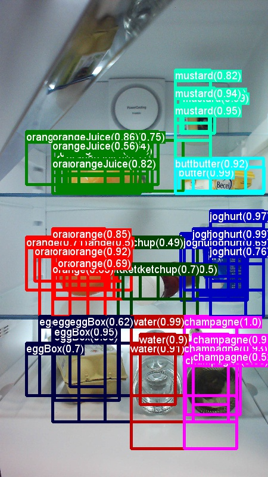
</p>

### Mean Average Precision
Once trained, the quality of the model can be measured using different criteria, such as precision, recall, accuracy, area-under-curve, etc. A common metric which is used for the Pascal VOC object recognition challenge is to measure the Average Precision (AP) for each class. Average Precision takes confidence in the detections into account and hence assigns a smaller penalty to false detections with low confidence. For a description of Average Precision see [Everingham et. al](http://homepages.inf.ed.ac.uk/ckiw/postscript/ijcv_voc09.pdf). The mean Average Precision (mAP) is computed by taking the average over all APs.

FUTURE WORK
---------------

One big item for future work is to use CNTK's Python APIs. Once these are fully available, the following changes can be made which should significantly improve run-time performance and simplify the code:
- Reduce start-up time by loading in the model only once and then keeping it persistent in memory.
- Reduce processing time using in-memory calls of the python wrappers, rather than writing all inputs and outputs to file first and subsequently parsing the CNTK output back into memory (e.g. this is especially expensive for the temporary file *train.z* in step 3 which can be many Gigabytes in size).
- Reduce code complexity by evaluating the network for each ROI on-the-fly in the `im_detect()` function rather than pre-computing all outputs in steps 4 and 5.

Other items for future work include:
- Evaluating alternatives to the currently used selective search implementation.
- Adding bounding box regression.
- Implementation of fast*er* R-CNN, i.e. performing ROI generation inside the DNN.
- Using a more recent DNN topology such as ResNet instead of AlexNet.


AUTHOR
---------------
Patrick Buehler, Senior Data Scientist
